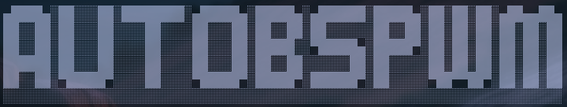

# AutoBspwm

<p align="center">
    
</p>

__AutoBspwm__ es un script en bash  que automatiza la configuración de un entorno en Linux enfocado para el estudio de __ciberseguridad__, incluyendo la instalación de una aplicación como __Obsidian__ para la toma de apuntes.

<p align="center">
    
</p>

<p align="center">
    
</p>


¡Este es el entorno que utiliza [s4vitar](https://www.youtube.com/@s4vitar), con pequeñas diferencias!

Ha sido probado tanto en __Kali Linux__ como en __ParrotOS__ y funciona correctamente.
La configuración también se aplica en __Ubuntu__, pero al entrar al entorno __da problemas con las interfaces gráficas de las aplicaciones__, por ende no está totalmente funcional en Ubuntu.

Si lo aplicas en alguna distribución distinta, tendrá que ser basada en __Debian__. Ten en cuenta que podría dar algún error por las diferencias entre configuraciones que aplican algunas.

Además, en la carpeta __Notes__ se encuentran los apuntes indicando paso a paso toda la configuración. Algunas cosas no son explicadas totalmente, por lo que tendrás que tener cierto conocimiento de movimiento en terminal y edición de archivos con Nvim o Nano.

## Tabla de contenidos

- [¿Cómo lo utilizo?](#¿Cómo-lo-utilizo?)
- [Atajos de teclado](#Atajos-de-teclado)
- [Explicación del código](#Explicación-del-código)
- [Créditos](#Créditos)

## ¿Cómo lo utilizo?

Para utilizarlo y configurar el entorno con el script, es sencillo.

1. Primero que todo, antes de tener el script listo para ejecutar, tendremos que asegurarnos de por nuestra cuenta __actualizar el sistema__.

    Esto es necesario porque en __kali__ podría darnos un problema y prácticamente quedarse colgado en la actualización, debido a que el output del comando __apt upgrade__ queda oculto al ejecutar el script y kali genera un panel en el cual espera un input del usuario.

    Para actualizar nuestro sistema, en este caso como ha sido testeado en __kali__ y __parrot__, se hace de distinta manera, ten cuidado como actualizas __parrot__, ya que podrías romper el sistema si utilizas el comando convencional.

    - __Parrot__:

        ```bash
        sudo apt update && sudo parrot-upgrade
        ```

    - __Kali Linux__:

        ```bash
        sudo apt update && sudo apt upgrade -y
        ```


2. Ahora, asegúrate de clonar el repositorio al directorio de descargas, con el siguiente comando:

    ```bash
    git clone https://github.com/sammy-ulfh/AutoBspwm.git
    ```

3. Entra en el directorio del script:

    ```bash
    cd AutoBspwm
    ```

4. El script nos pedirá la contraseña del usuario root  al actualizar el sistema, si queremos asegurar que eso no pase, podríamos convertirnos en root y salir de él antes de utilizar el script.

    - __Primero ejecutar__:

        ```bash
        sudo su
        ```

    - __Después salir del usuario root__:

        ```bash
        exit
        ```

5. Ahora es momento de utilizar el script.

    Para que nos funcione sin ningún problema, tendremos que asegurarnos que la carpeta AutoBspwm se encuentra dentro del directorio de descargas y que además estamos intentando ejecutar el script AutoBspwm.sh encontrándonos dentro del directorio AutoBspwm y como usuario no privilegiado.

    ```bash
    ./AutoBspwm.sh
    ```

    Ahora comenzaría a trabajar el script de la siguiente manera:

    [](https://youtu.be/YjeFjs_LgCQ)

6. Finalmente, seguiríamos lo siguiente que sería abrir todo para que se apliquen las configuraciones y podamos disfrutar totalmente del entorno configurado:

    [](https://youtu.be/4bZofnCX02A)

Cualquier duda o paso no aplicado como la configuración del navegador, en la carpeta Notes se encontraran los apuntes tomados en Obsidian, paso a paso. 

Ten en cuenta que deberás tener al menos conocimiento de como moverte por Linux, ya que hay cosas que no se explican del todo.

## Atajos de teclado


- __Sistema__:

    | Nombre                                                 | Atajo                                                    |
    |--------------------------------------------------------|----------------------------------------------------------|
    | Abrir terminal                                         | Windows + enter                                          |
    | Cerrar aplicación                                      | Windows + q                                              |
    | Abrir rofi                                             | Windows + d                                              |
    | Preselectores                                          | ctrl + windows + alt + flecha                            |
    | Preselectores preestablecidos                          | ctrl + windows + numero                                  |
    | Resize en ventanas                                     | windows + alt + flecha                                   |
    | Mover una ventana a la posición de otra                | windows + shift + flecha                                 |
    | Mover ventana a uno de los 9 espacios del escritorio   | windows + shift + numero_espacio                         |
    | Desacoplar ventana                                     | windows + s                                              |
    | Mover una ventana desacoplada                          | windows + click_izquierdo + mover mouse                  |
    | Resize a una ventana desacoplada                       | windows + click_derecho en una esquina + mover mouse     |
    | Acoplar nuevamente una ventana                         | windows + t                                              |
    | Maximizar una ventana                                  | windows + f                                              |
    | Regresar al tamaño que tenía                           | windows + t                                              |
    | Bloquear pantalla (solo como usuario no privilegiado)  | windows + shift + x                                      |
    | Abrir firefox                                          | Windows + shift + f                                      |
    | Abrir Mullvad browser                                  | windows + shift + d                                      |


- __Kitty__:


    | Nombre                                                    | Atajo                                                    |
    |-----------------------------------------------------------|----------------------------------------------------------|
    | Abrir un nuevo panel en la kitty                          | ctrl + shift + enter                                     |
    | Cerrar un panel en la kitty                               | ctrl + shift + w                                         |
    | Resize en paneles de la kitty      /       salir          | ctrl + shift + r       /      q                          |
    | Zoom a un panel en la kitty                               | ctrl + shift + z                                         |
    | Crear nuevo espacio de trabajo en la kitty                | ctrl + shift + t                                         |
    | Renombrar un espacio de trabajo en la kitty               | ctrl + shift + alt + t                                   |
    | Cerrar un espacio de trabajo en la kitty                  | ctrl + shift + q                                         |
    | Alternar espacios de trabajo en la kitty a la izquierda   | ctrl + shift + ,                                         |
    | Alternar espacios de trabajo en la kitty a la derecha     | ctrl + shift + .                                         |
    | Moverse entre espacios de trabajo de la kitty             | ctrl + shift + flecha izq/derecha                        |


- __Otros__:


    | Nombre                                                    | Atajo                                                    |
    |-----------------------------------------------------------|----------------------------------------------------------|
    | Buscar por archivos específicos                           | ctrl + t (desde terminal)                                |
    | Buscar sobre el histórico de comandos por similares       | ctrl + r (desde terminal)                                |


## Explicación del código

El código es un script de bash, el cual está dividido por funciones. Por ello, cada función realiza una tarea con base en la configuración del entorno.

Dividiendo la configuración en partes, dándote la posibilidad de si tiene algún error al ejecutarse, ver en que parte lo dio y buscar una posible solución.

__Funciones y explicación:__

- __move_to_desktop__:
    
    Esta función se encarga de movernos a la carpeta Desktop del directorio home, en las ocasiones que se requiera para realizar alguna cosa.

- __move_to_downloads__:

    Esta función se encarga de movernos a la carpeta Downloads o Descargas del directorio home, en las ocasiones que se requiera para realizar alguna cosa.

- __save_status__:

    Esta función es llamada, después de realizar casi cada comando, para checar la mayoría de cosas que se realicen dentro de la función y si alguna de estas retorna un código de estado distinto a 0, el contenido de la variable __status__ cambiará a ese código de estado.

- __check_status__:

    Esta función se encarga de revisar que la variable __status__ sea igual a 0 al finalizar la ejecución de una función, si la variable __status es distinta de cero__ significa que algo salió mal, por ende se detendrá el programa y retornará un texto indicando en que parte salió algo mal.

    Además, esto es fácil de notar, debido a que el script en todo momento te indica que es lo que está realizando.

- __update_upgrade__:

    Esta función validará en contenido de una variable, lo cual le es enviado como argumento una vez se verifica si está frente a un sistema parrot o no, por la diferencia en cuanto a la forma de actualizarse.

    En cuanto a kali, como hay problemas en cuanto a los repositorios, ya que no encuentra ciertos paquetes, son agregados los repositorios de __Debian__ a su lista con ruta absoluta /etc/apt/sources.list.

    Primero verificará si ya los tiene, en caso de que hayas ejecutado antes el script y te haya dado algún problema.

    Una vez verificado, actualizará el sistema.

- __install_packages__:

    Esta función se encarga de instalar todos los paquetes necesarios para la configuración del entorno con bspwm y sxhkd.

- __bspwm_sxhkd__:

    Esta función se encarga de instalar bspwm y sxhkd gracias a sus repositorios, además llevará la configuración de ellos ya almacenada en __AutoBspwm/.config__.

- __kitty__:

    Esta función se encargará de instalar la versión más reciente de la kitty, lo cual se puede hacer gracias a un comando brindado directamente en la página de [kitty](https://sw.kovidgoyal.net/kitty/).

Además, agregará su configuración, la cual ya se encuentra en __AutoBspwm/.config__.

- __polybar__:

    En esta función se carga la configuración de la polybar ya almacenada en AutoBspwm/.config

    Además, toma de AutoBspwm/polybar, las fuentes necesarias y las lleva al directorio correspondiente, así como lo hace con las fuentes de Ned fonts.

    Finalmente, sincroniza o limpia la caché.

- __picom__:

    Esta función se encarga de instalar picom gracias a su repositorio, así como agregar la configuración de esta ya almacenada en __AutoBspwm/.config__.

- __rofi__:

    Esta función se encarga de almacenar los temas ya almacenados en AutoBspwm en sus lugares correctos, además de modificar el archivo config.rasi, para que quede lista toda la configuración del lanzador de aplicaciones rofi.

- __zsh__:

    Esta función se encarga de instalar el powerlevel10k y además cargar las configuraciones para root como para usuario no privilegiado, las cuales están almacenadas en AutoBspwm como archivos ocultos.

    Finalmente, carga la configuración de .zshrc y crea un enlace simbólico para que el usuario root utilice la misma configuración.

- __batcat_lsd__:

    Esta función se encarga de instalar batcat en su versión 0.24.0 y lsd en su versión 1.1.5. Por ende, si deseas tener la versión más reciente, tendrás que hacerlo manualmente.

- __Burpsuite__:

    __Burpsuite__ tiene el problema de que no se adapta al tamaño total de la pantalla, por ende se crea el script __burpsuite-launcher__ para poder ejecutarlo como aplicación, dando las indicaciones para que se adapte al tamaño de la pantalla antes de ejecutarlo.

- __fzf__:

   Esta función trae el repositorio de fzf y realiza su instalación sin necesidad de que el usuario ingrese el output que solicita. 

- __neovim__:

    Esta función desinstala en __Neovim__ que pueda venir por defecto en el sistema, para después tomar la aplicación Neovim dentro de AutoBspwm, además de agregar las configuraciones almacenadas en __AutoBspwm/.config/__.

- __i3lock-fancy__:

    Esta función se encarga de instalar i3lock-fancy.

- __obsidian__:

    Esta función se encarga de llevar la aplicacion __.AppImage__ de Obsidian almacenada en AutoBspwm a __/opt__ y además agrega un script que se encarga de abrirla como si de una aplicación del sistema se tratase.

- __mullvad__:

    Realiza la descarga de la versión más reciente de Mullvad browser y lo almacena en el directorio /opt, para después darle los permisos necesarios para que pueda ser ejecutado por el usuario no privilegiado.

    Además, para evitar problemas con la ejecución, se crea el script Mullvad-launcher y se agrega a /usr/bin para poder ser ejecutado como una aplicación sin ningún problema.

- __shell__:

    Esta función se encarga de configurar la Shell por defecto para el usuario privilegia y no privilegiado, asignando la zsh como terminal predeterminada.

- __root_checker__:

    Esta función se encarga de verificar si el programa se está ejecutando como usuario no privilegiado, por medio del uid.

- __pwd_checker__:

    Esta función se encarga de verificar que estemos ejecutando la el script dentro del directorio AutoBspwm y que este se encuentre dentro de la carpeta de descargas.

- __main__:

    La función __main__ es nuestra función principal, donde se ejecuta cada función de forma ordenada para aplicar toda la configuración correctamente, además después de ejecutar cada función se verifica que se haya ejecutado todo correctamente gracias a __check_status__.

## Créditos

Este proyecto es una automatización del entorno de trabajo que utiliza [S4vitar](https://www.youtube.com/@S4viOnLive) con ligeras modificaciones.
